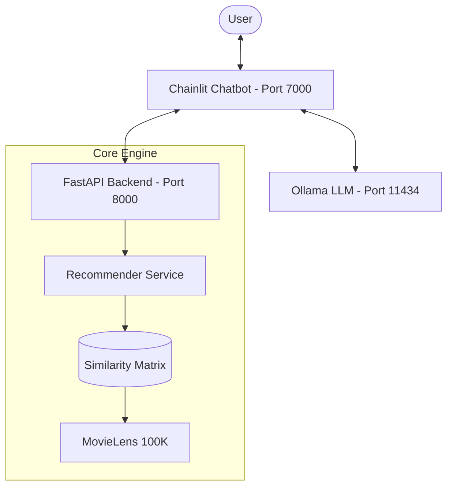

# 🎬 Movie Recommendation Engine

A conversational and API-driven movie recommendation system built on the MovieLens 100K dataset. It uses item-item collaborative filtering with cosine similarity to find hidden patterns in user behavior.

---

## 📊 Dataset
- **Source**: [MovieLens 100K](https://grouplens.org/datasets/movielens/100k/)
- **Size**: 943 users, 1682 movies, 100,000 ratings
- **Timeline**: Collected between September 1997 and April 1998

---

## 🌟 Overview
This project provides a full-stack recommendation experience:
1.  **FastAPI Backend**: A robust server that calculates recommendations in real-time.
2.  **Chainlit Chatbot**: A natural language interface that uses **Ollama** to extract movie titles from user messages.
3.  **Collaborative Filtering**: Recommendations are grounded in actual user ratings, not just genres.

### 🎓 Assignment Requirements Fulfilled

> *"Please document the code well and write down what it does and doesn’t do, what kind of algorithm it uses and what are the assumptions. This engine, when run, given a set of up to 5 movies, will suggest to me up to 10 more. Bonus if it can tell me why it is suggesting those ones."*

* **What it does & doesn’t do:** Detailed in the [Detailed Implementation](docs/detailed_implementation.md) doc. 
* **Algorithm Used:** Item-item collaborative filtering via cosine similarity.
* **Assumptions:** Explicitly listed under the **Assumptions** and **Known Limitations** sections in [Detailed Implementation](docs/detailed_implementation.md).
* **Input/Output Constraints:** The FastAPI backend and Chainlit UI successfully accept up to 5 movie titles and return exactly top 10 recommendations.
* **Bonus Achieved:** Every recommendation includes a `reason` field, explaining the suggestion based on shared genres or collaborative filtering signal. 
* **Code Documentation:** The entire `src/` package and `api/` backend are fully documented with Python docstrings.

---

## 🚀 Quick Start (Automated)

### 1. Prerequisites
- **Python 3.12+**
- [**uv**](https://github.com/astral-sh/uv) package manager
- [**Ollama**](https://ollama.com/) (Required for chatbot movie extraction):
    - **Windows/Mac**: Download from [ollama.com/download](https://ollama.com/download)
    - **Linux**: `curl -fsSL https://ollama.com/install.sh | sh`

### 2. Launch the System
You can launch the entire system (Backend, UI, and Local LLM) with a single command:

```bash
uv sync
./start.sh
```

- **Chatbot UI**: [http://localhost:7000](http://localhost:7000)
- **API Documentation**: [http://localhost:8000/docs](http://localhost:8000/docs)
- **Local LLM**: Powered by Ollama (`llama3.1:latest`)

---

## 🏗️ Project Structure
```text
.
├── api/                # FastAPI application & routers
├── data/               # Raw MovieLens dataset files
├── docs/               # Detailed technical documentation
├── output/             # Precomputed similarity matrices & EDA plots
├── src/                # Core recommender logic & CLI
├── main.py             # Chainlit Chatbot entry point
├── start.sh            # Automated startup script
└── tests/              # Unit and integration test suite
```

---

## 🖇️ Architecture



---

## 📖 Further Reading
For a deep dive into the ETL process, the math behind cosine similarity, and the full implementation steps (1-5), please see:

👉 [**Detailed Implementation & Technical Notes**](docs/detailed_implementation.md)

---

## 👤 Author
- Dataset: MovieLens 100K by GroupLens Research, University of Minnesota
